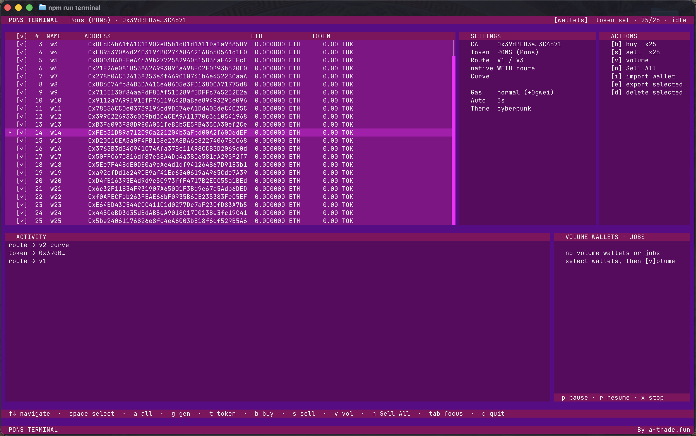

# Pons Terminal

> Multi-wallet Pons trading terminal for Robinhood Chain.

[](https://nodejs.org/)
[](https://www.typescriptlang.org/)
[](LICENSE)

**Pons Terminal** is an independent, open-source trading terminal for trading tokens on [Ponsfamily](https://ponsfamily.com) using multiple local wallets on Robinhood Chain.

It combines route-aware trades, bulk wallet actions, volume automation, encrypted wallet storage, and **Multi-Wallet Sell All** in one local terminal.

Pons Terminal is not affiliated with or endorsed by Pons, Ponsfamily, or Robinhood.

## About Pons Terminal

Pons Terminal is built for people who trade on **Ponsfamily** and need a focused **Pons multi-wallet trading terminal** on **Robinhood Chain**. It supports bulk wallet execution, Pons volume workflows, and a multi-wallet sell flow for active token positions.



## Features

| Feature | What it does |
|---|---|
| **Multi-wallet trading** | Import or generate wallets, choose a set, and trade from all of them. |
| **Buy strategies** | Per-wallet buys, equal split, proportional split, and arithmetic, geometric, or list ladders. |
| **Sell** | Sell a chosen percentage of token holdings from selected wallets. |
| **Volume** | Run Buy → Sell cycles with dedicated wallets. |
| **Multi-Wallet Sell All** | Collect eligible wallet balances into one holding wallet and sell its complete live balance. |
| **Route-aware execution** | Detects supported Pons market routes before dispatching trades. |
| **Wallet vault** | Keeps imported and generated wallets encrypted locally. |
| **Live terminal** | Shows wallet balances, active jobs, route state, and an activity log. |

## Installation

### Requirements

- Node.js 20 or newer
- Git, or a downloaded source ZIP
- ETH on Robinhood Chain for transaction gas and trading balances

Install Node.js from [nodejs.org](https://nodejs.org/) if it is not already installed. Confirm the installation:

```bash
node -v
npm -v
```

### Get Pons Terminal

```bash
git clone https://github.com/yesiambroke/pons-terminal.git
cd pons-terminal
npm install
npm run terminal
```

If you downloaded a ZIP instead, unzip it, open a terminal in that folder, then run:

```bash
npm install
npm run terminal
```

On first launch, Pons Terminal creates the local vault configuration it needs. The built-in HOODL routers are part of the application configuration, so you do not need to set or edit router addresses.

`npm run ui` remains available as an alias for existing installs. New documentation uses `npm run terminal`.

## Network, RPC, and Fees

### RPC

Pons Terminal uses **Arrow RPC** by default on first launch:

```text
https://rpc.arrowrpc.com
```

This public endpoint is suitable for getting started and currently provides approximately **100 requests per second**. It is written to the generated local `.env` as `RPC_URL`.

For sustained multi-wallet trading, volume, or high-frequency use, use your own private or paid Robinhood Chain RPC. Replace only the `RPC_URL` value in your local `.env`:

```text
RPC_URL=https://your-rpc-provider.example
```

Do not share your private RPC URL if it contains credentials.

### Trading fee

Pons Terminal charges a **0.5% HOODL trading fee per swap leg**.

- A Buy is one swap leg.
- A Sell is one swap leg.
- A standard Volume cycle includes a Buy and a Sell, so both legs carry the fee.
- Multi-Wallet Sell All includes transfer transactions plus one final sell leg; transfers are ERC-20 transfers and the final swap carries the trading fee.

The HOODL router addresses are embedded in the application. They are intentionally not user-editable through `.env`; changing them can break route handling and fee settlement.

## First Session

1. Launch the terminal with `npm run terminal`.
2. Add a wallet with `i`, or create one with `g`.
3. Send ETH on Robinhood Chain to the wallet for gas and trading.
4. Press `t` and paste the token contract address you want to trade from Ponsfamily or an explorer.
5. Wait for route detection and wallet balances to refresh.
6. Use Buy, Sell, Volume, or Multi-Wallet Sell All.

## Terminal Controls

| Key | Action |
|---|---|
| `b` | Buy using checked wallets |
| `s` | Sell a percentage using checked wallets |
| `v` | Start Volume using checked wallets |
| `n` | **Multi-Wallet Sell All** across eligible vault wallets |
| `space` | Check or uncheck the focused wallet |
| `a` | Select or clear all non-Volume wallets |
| `c` | Copy the focused wallet address |
| `t` | Set token contract address |
| `i` | Import wallet |
| `e` | Export checked wallets after confirmation |
| `d` | Delete checked wallets after confirmation |
| `g` | Generate wallet |
| `p` / `r` / `x` | Pause / resume / stop a job |
| `tab` | Move between WALLETS, SETTINGS, ACTIONS, and JOBS |
| `?` | Show available shortcuts in Activity |

## Multi-Wallet Trading

For Buy, Sell, and Volume, wallet checkboxes define the wallets used by the action.

### Buy

Press `b` after checking wallets. Choose one of the available strategies:

- **Individual**: the entered amount is used by each checked wallet.
- **Split equal**: one total is divided evenly.
- **Split proportional**: one total is divided by available wallet ETH balance.
- **Ladder**: uses arithmetic, geometric, or explicit CSV amounts.

### Sell

Press `s` after checking wallets. Enter the percentage of each checked wallet's current token holding to sell.

### Volume

Press `v` after checking wallets. Each selected wallet runs a Buy → Sell cycle. The terminal reserves those wallets while the job is queued, running, or paused so other trading actions do not compete for the same wallet.

## Multi-Wallet Sell All

Press `n` to liquidate the active token across the local vault. This action does not use the normal checkbox selection.

1. Pons Terminal finds every vault wallet with a positive balance of the active token.
2. Wallets dedicated to an active Volume job are skipped.
3. One holding wallet is chosen at random as the collection wallet.
4. Other holding wallets transfer their full token balances to it in parallel.
5. After all transfer attempts settle, the collection wallet sells **100% of its current token balance**.

The final sell includes the collection wallet's original holding. If it starts with `200 TOK` and receives `100 TOK`, it sells `300 TOK`.

If one wallet transfer fails, the others continue. The collection wallet still sells whatever balance it holds after the transfer phase. Activity records each transfer, failure, and final sell.

> **Warning**  
> Multi-Wallet Sell All submits real token transfers and swaps. Press `n` only when you intend to liquidate the selected token across every eligible wallet in the local vault.

## Router Configuration

Pons Terminal uses embedded HOODL router addresses for supported routes. Router addresses are intentionally not editable through `.env` because changing them can break route handling and fee settlement.

The local `.env` is only for:

| Variable | Purpose |
|---|---|
| `RPC_URL` | Robinhood Chain RPC endpoint; Arrow RPC is the generated default |
| `WALLET_ENC_KEY` | Local encrypted-vault key; generated automatically on first terminal launch |
| `PRIVATE_KEY` | Optional, for the single-wallet CLI only; not needed for the multi-wallet terminal |

## Security

- Wallet keys in the terminal vault are encrypted at rest.
- Never commit `.env`, vault data, private keys, or seed phrases.
- Use dedicated trading wallets and keep only the balance needed for the operation.
- Wallet export and deletion require explicit confirmation.
- Review the token CA, route state, wallet balances, and gas before sending transactions.

## Build

```bash
npm run build
npm run terminal
```

## Contact

Follow me on X for updates or feedback: [@420Congo](https://x.com/420Congo)

## Related Searches

Pons Terminal shows up when people search GitHub for **Pons trading bot**, **Pons multi wallet**, **Pons bundler**, **Ponsfamily trading tool**, **Pons volume bot**, **Robinhood Chain trading bot**, **Robinhood Chain multi wallet**, **Robinhood Chain volume bot**, **Robinhood Chain DEX terminal**, and **crypto multi wallet terminal**. If you are looking for a focused terminal for trading tokens on Ponsfamily through several local wallets on Robinhood Chain, this is the project.

## License

MIT
